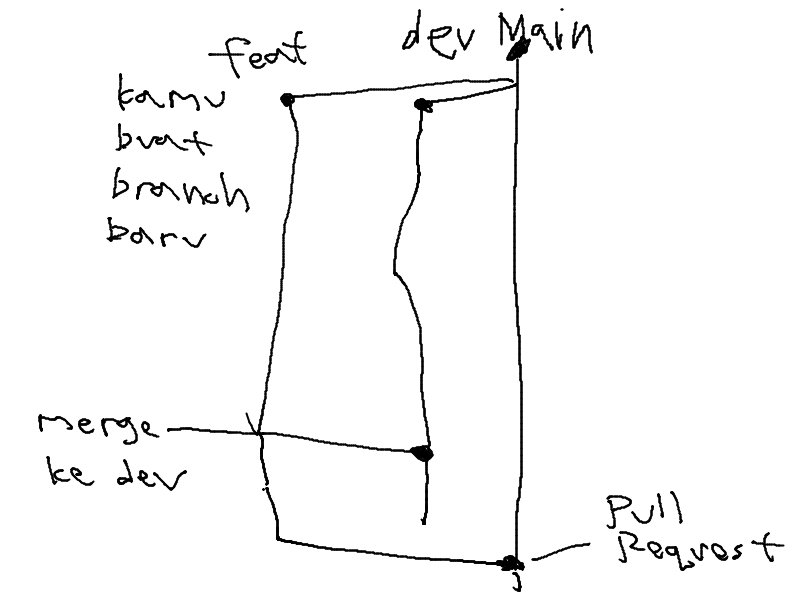

# ALL OF HOW TO's
## Table of Contents
- [How to Clone and Setup Repos](#how-to-clone-and-setup-repos)
    - [For SSH](#for-ssh)
    - [For HTTPS](#for-https)
- [What to Do After Getting a Task](#what-to-do-after-getting-a-task)
    - [Setup](#setup)
    - [Running Locally](#running-locally)
    - [Workflow](#workflow)
    - [Releasing](#releasing)

# How to Clone and Setup Repos
## For SSH

```
git clone git@github.com:effiecient/effie-FE.git
cd effie-FE
git remote set-url origin --push --add git@gitlab.informatika.org:if3250-k1-g1/effie-FE.git
git remote set-url origin --push --add git@github.com:effiecient/effie-FE.git
cd ..

git clone git@github.com:effiecient/effie-BE.git
cd effie-BE
git remote set-url origin --push --add git@gitlab.informatika.org:if3250-k1-g1/effie-BE.git
git remote set-url origin --push --add git@github.com:effiecient/effie-BE.git
```

## For HTTPS

```
git clone https://github.com/effiecient/effie-FE.git
cd effie-FE
git remote set-url origin --push --add https://gitlab.informatika.org/if3250-k1-g1/effie-FE.git
git remote set-url origin --push --add https://github.com/effiecient/effie-FE.git
cd ..

git clone https://github.com/effiecient/effie-BE.git
cd effie-BE
git remote set-url origin --push --add https://gitlab.informatika.org/if3250-k1-g1/effie-BE.git
git remote set-url origin --push --add https://github.com/effiecient/effie-BE.git
```

# What to Do After Getting a Task
### Setup
1. Go to branch `main` and pull the latest changes with `git pull`.
2. Setup your environment by creating a `.env` file. (See `.env.example` for reference)

### Running Locally
1. Setup your hosts file first
    - For windows, go to `C:\Windows\System32\drivers\etc\hosts` and add `127.0.0.1 www.example.com <your-username>.example.com`
    - For linux, go to `/etc/hosts` and add `127.0.0.1 www.example.com <your-username>.example.com`
2. Run `pnpm install` to install all dependencies.
3. Run `pnpm dev` to start the development server.
4. You can access the page from `www.example.com:3000`


### Workflow
1. Go to branch `main` and pull the latest changes with `git pull`.
2. Create a new branch with `git checkout -b <branch-name>`. The `branch-name` should follow the convention e.g. `feat/login` or `fix/register`
3. Do your task.
4. Commit your changes with `git add .` and `git commit -m "<commit-message>"`.
5. Push your changes to the remote branch with `git push`.
6. Go to branch `dev` with command `git checkout dev` and pull the latest changes with `git pull`. Then, merge your branch and squash it with `git merge --squash <branch-name>`.
7. Push your changes in `dev` to the remote branch with `git push`.
8. Create a pull request for your branch to `main` branch.

### Releasing
1. Go to branch `main` and pull the latest changes with `git pull`.
2. Create a tag with `git tag -a <tag-name>`.
3. Push your changes to the remote branch with `git push`.
4. Go to gitlab page to release the tag.
5. Reset the dev branch, go to branch `dev` and pull the latest changes with `git pull`.
6. Reset the dev branch with `git reset --hard <tag-name>`.

## Conventions
-   Use `"` for strings
-   Use 2 spaces
-   Use `;`

## Flow Visualization

